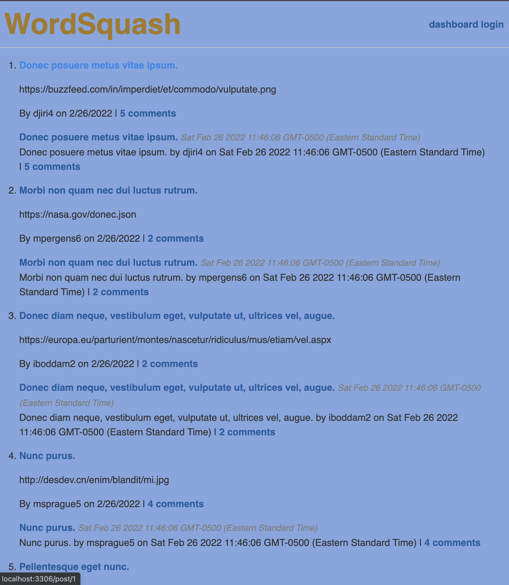
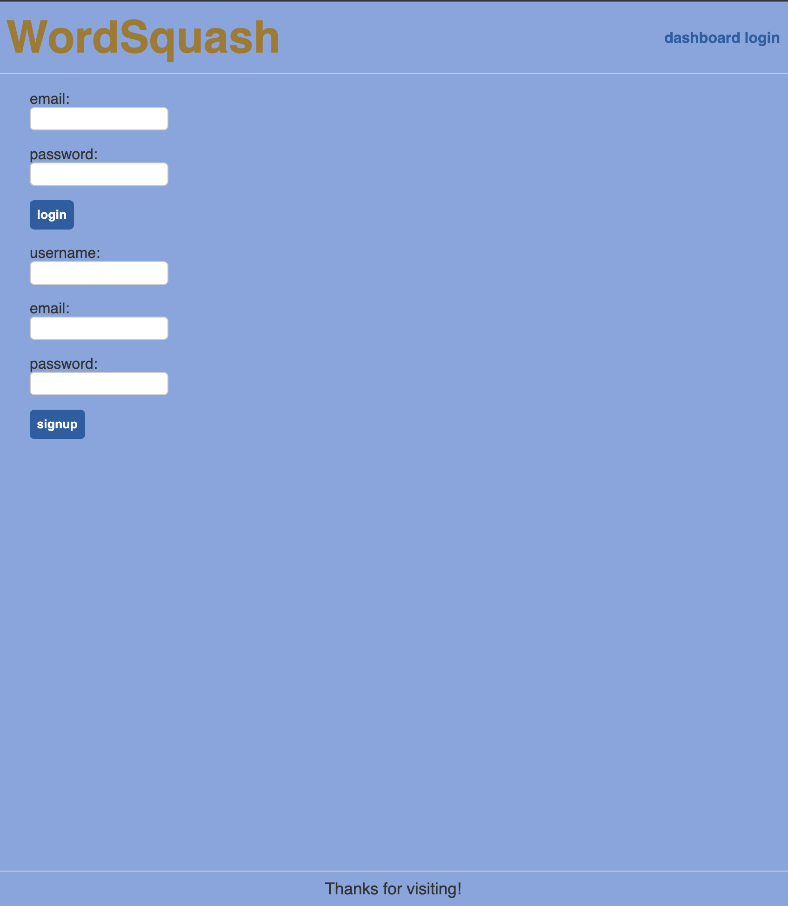
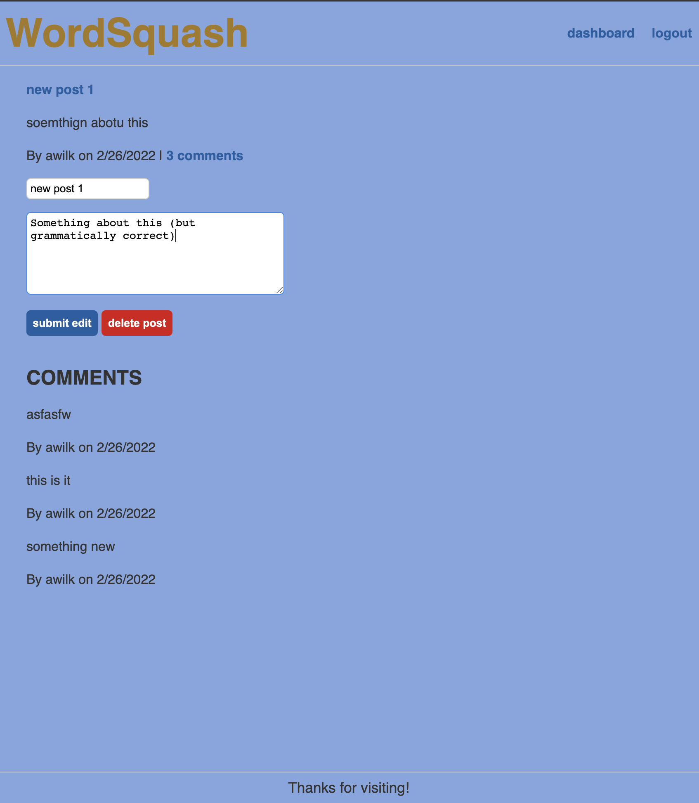
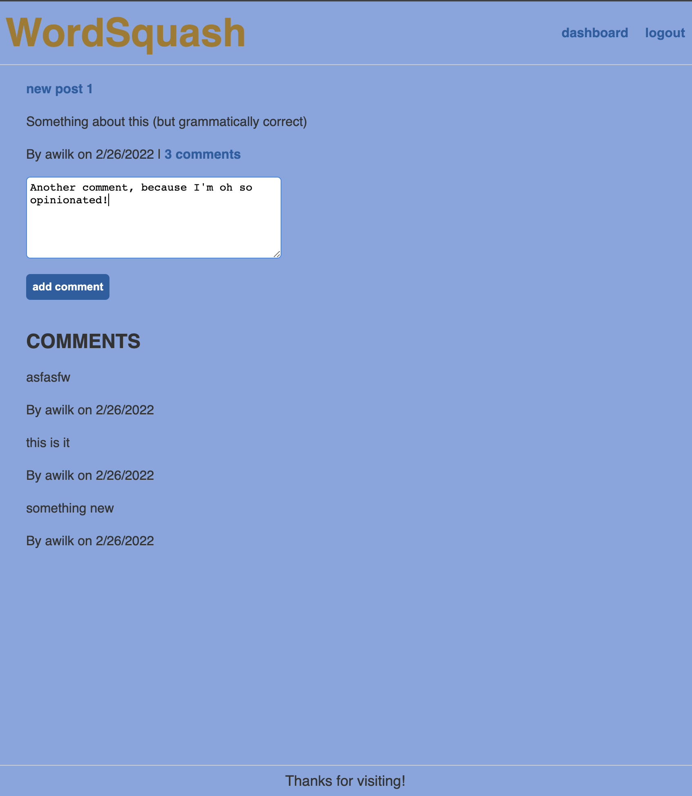

# Wordsquash 

Wordsquash is a Wordpress-like CMS blog site to capture all of your tech blogging needs.
  
## Description

Are you interested in tech and chatting with others that are just as keen as you? Well come to Wordsquash where you can chat with other like-minded bloggers.

In this CMS style blog site users can create an account where they are able to post content with title, update post content and title, and comment on other users' posts. With all this, we hope to foster a rich community of users interested in tech!

[GitHub Repo](https://github.com/a-breezy/wordsquash)
[Deployed App](https://stormy-ridge-45640.herokuapp.com/)

## Table of Contents

  * [Installation](#installation-instructions)
  * [Usage](#usage)
  * [License](#license)
  * [Collaborators](#collaborators)
  * [How to Contribute](#how-to-contribute)
  * [Tests](#tests)
  * [Questions](#questions)

## Installation Instructions

Simply open the app at its [deployed location](https://stormy-ridge-45640.herokuapp.com/) and start blogging to your hearts content!

---
## Usage

*Landing Page*

*Login Page*

*User Dashboard*

*Page to Edit Post*

*Page to Comment on a Post*

---
## License

  [License: MIT](https://opensource.org/licenses/MIT)
  

---
## Collaborators

None

---
## How to Contribute

None

---
## Tests

None

---
## Questions

ambrose.wilkins@gmail.com
